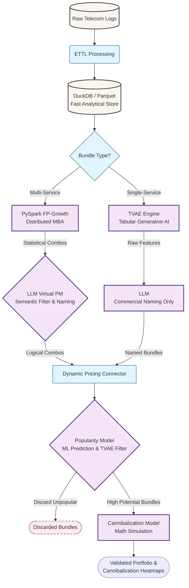
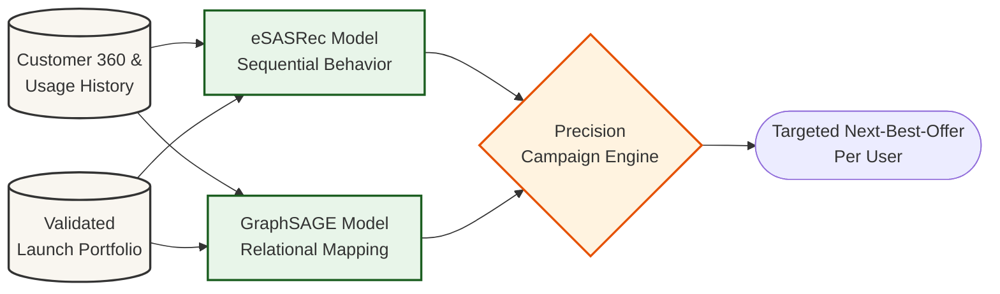
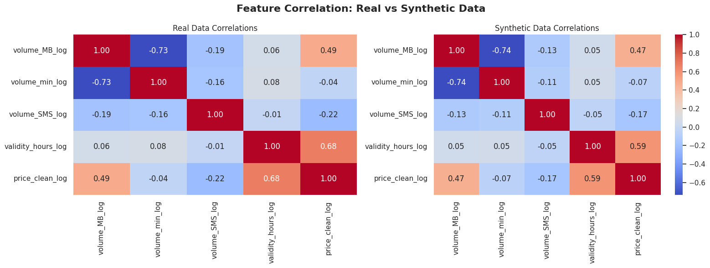
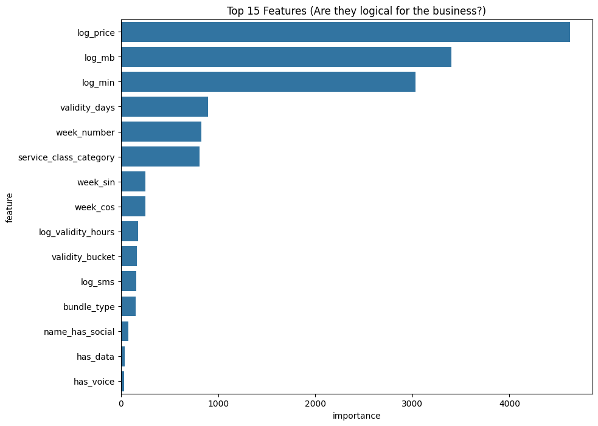

# MinTel - Autonomous Telecom Product Intelligence Platform

**An AI-powered system for intelligent telecom product optimization, customer targeting, and pre-launch campaign simulation.**

MinTel is an advanced, data-driven intelligence platform built specifically for the highly competitive telecommunications sector. Designed for product managers, pricing teams, marketing strategists, and data analysts, it transitions product design from a sluggish, intuition-based process to a rapid, fully autonomous strategy. By integrating Generative AI, Market Basket Analysis (MBA), sequential recommendation models, and rigorous mathematical modeling, MinTel simulates market behavior, generates highly optimized telecom bundles, and precisely predicts commercial impact.


## Table of Contents

- [Problem Statement](#problem-statement)
- [Solution](#solution)
- [Features](#features)
- [System Architecture](#system-architecture)
- [Core AI Models & Mathematics](#core-ai-models)
- [Tech Stack](#tech-stack)
- [Demo](#demo)
- [Project Structure](#project-structure)
- [Installation](#installation)
- [Evaluation](#evaluation)
- [Roadmap](#roadmap)
- [License](#license)
- [Author](#author)


## Problem Statement

In the fast-paced and highly saturated telecom market, operators face critical strategic challenges and operational bottlenecks when designing and launching new products:

*   **Sluggish Product Innovation:** The traditional, manual approach to designing telecom products is incredibly slow and heavily reliant on human intuition. This leads to severe delays, causing operators to miss out on vital revenue opportunities when they fail to respond rapidly to shifting market dynamics.

*   **Poor Targeting Accuracy:** Relying on broad demographic segmentation completely ignores nuanced behavioral differences. Directing campaigns toward generic "potential buyers" rather than actively persuadable customers results in poor engagement and drastically wasted marketing budgets.

*   **High Commercial & Network Risks:** Launching bundles blindly, without conducting rigorous pre-launch market simulations, exposes the operator to unforeseen commercial losses and severe network congestion risks.

*   **The Cannibalization Threat:** Introducing poorly analyzed bundles can negatively cannibalize the sales of existing high-performing plans, simultaneously shrinking profit margins and complicating the product catalog.

*   **Lost Revenue Leakage:** Delayed decision-making directly translates to missed opportunities in vital areas such as Upsell, Cross-sell, and Customer Retention.

### Project Objectives
*   Maximize incremental revenue and contribution margins.
*   Strategically optimize the product portfolio while boosting customer retention and brand loyalty.
*   Transform product design from a reactive, manual task into a proactive, fully data-driven engine.
*   Empower commercial and technical teams to make faster, smarter, and highly profitable decisions through the automation of complex analytical processes.

## Solution / Overview

MinTel solves these industry-wide challenges through a highly automated, end-to-end pipeline that bridges raw telecom records with advanced generative modeling, behavioral targeting, and strict financial simulation. 

The system operates across a 4-stage intelligence architecture:

1.  **Data Foundation Layer:** An automated ETTL pipeline processes granular transaction logs, geospatial metadata, device telemetry, and historical commercial performance (via DuckDB and Parquet) to establish a clean, real-time data foundation.

2.  **Generative & Pricing Engine:** Synthesizes new telecom bundles using Tabular Variational Autoencoders (TVAE) for single services, and PySpark-distributed Market Basket Analysis (FP-Growth) for multi-service combos. An LLM acts as a "Virtual Product Manager" to logically name and structure the bundles, which are then passed through dynamic pricing algorithms.

3.  **Commercial Simulation & Cannibalization:** Before launch, generated bundles are mathematically evaluated. Custom machine learning models predict market popularity, while a rigorous cannibalization framework calculates exact net revenue impact, preventing the new bundles from stealing revenue from the existing portfolio.

4.  **Targeting & Recommendation:** Finally, the system identifies the perfect audience for the validated bundles using GraphSAGE (structural relationships) and eSASRec (sequential behavior), enabling precision marketing campaigns.

> **Note:** For a deep dive into the mathematical formulas and exact machine learning architectures used in the Popularity and Cannibalization models, please refer to the [Core AI Models & Mathematics](#core-ai-models) section below.


## Features

*   **Autonomous Product Synthesis (GenAI & MBA):** A zero-touch generative pipeline that automatically designs commercially viable telecom bundles. It utilizes **Tabular Variational Autoencoders (TVAE)** for single-service plans and distributed **FP-Growth Market Basket Analysis** to discover statistically robust multi-service combos from millions of transactions.

*   **Virtual Product Manager (LLM Integration):** Integrates a Large Language Model as a semantic filter and creative engine. It takes raw statistical data and translates it into market-ready products by generating attractive commercial names, structuring quotas, and drafting logical business justifications for human review.

*   **Cannibalization & Net Revenue Simulation:** A rigorous mathematical engine that acts as a pre-launch safety net. It evaluates new bundles against the existing portfolio, outputting detailed **Impact DataFrames** and intuitive **$N \times M$ Cannibalization Heatmaps** to visually pinpoint high-risk overlaps and predict exact net revenue.

*   **Scale-Invariant Popularity Prediction:** Employs a custom machine learning model with deep temporal and NLP-based feature engineering to predict market adoption before launch, effectively handling the heavy-tailed distributions typical of telecom data.

*   **Precision Graph & Sequential Targeting:** Completely bypasses broad demographic segmentation by utilizing **eSASRec** (capturing chronological usage sequences) and **GraphSAGE** (mapping complex relational networks between users and products). It predicts the exact next-best-offer to target persuadable customers and maximize ROI.

*   **Dynamic Pricing Guardrails:** Features a dedicated pricing connector that ensures all AI-generated bundles are instantly priced within approved commercial elasticity bounds, preventing the generation of financially unviable offers.


## System Architecture

MinTel is built on a highly modular, decoupled machine learning architecture. To manage the complexity of telecom data, the system strictly separates product synthesis and financial simulation from customer targeting, ensuring high scalability and distinct optimization at each stage.

### 1. Product Intelligence & Simulation Pipeline
This pipeline is responsible for ingesting raw data, generating novel bundles, and mathematically simulating their commercial impact before they ever reach the market.



***Architectural Highlights (Phase 1):***

* Distinct Generative Workflows: The system routes single-service bundle generation to deep learning models (TVAE), while complex combos are handled by distributed statistical mining (PySpark FP-Growth).

* Asymmetric LLM Roles: For combo bundles, the LLM acts as a strict semantic gatekeeper (filtering illogical service combinations) and a naming engine. For TVAE-generated bundles, the LLM functions solely as a commercial naming engine.

* Sequential Filtering & Simulation: Priced bundles do not blindly enter the market. They are first evaluated by the Popularity Model, which actively filters out unviable TVAE-generated bundles. Only the high-potential surviving bundles are passed to the Cannibalization Model for final portfolio risk simulation.


### 2. Customer Targeting & Recommendation Engine
Once the bundle portfolio is validated and simulated, this pipeline determines the optimal audience. It utilizes a dual-algorithm approach to capture both sequential behavioral patterns and complex structural relationships.



***Architectural Highlights (Phase 2):***

* eSASRec (Temporal Focus): Analyzes the exact chronological order of a user's past subscriptions using self-attention mechanisms, predicting what they need next based on their specific timeline.

* GraphSAGE (Structural Focus): Constructs a heterogeneous bipartite graph mapping users to bundles. It captures latent similarities (e.g., users who share similar network mobility patterns or data usage thresholds), allowing the system to recommend bundles based on neighborhood connections rather than just demographics.

* Unified Campaign Output: The engine merges the insights from both models to dispatch highly personalized Next-Best-Offers, maximizing conversion rates.


## Core AI Models

This section outlines the mathematical frameworks, machine learning architectures, and statistical methodologies powering MinTel’s intelligence core. 

### 1. Bundle Synthesis Engine (TVAE & MBA)

The generation of new telecom products is handled by a dual-pathway architecture to accommodate both isolated services and complex service combinations:

*   **Tabular Generative AI (TVAE):** For single-service packages, the system employs Tabular Variational Autoencoders (TVAE). This allows the model to learn the complex, non-Gaussian distributions of historical telecom data (prices, validities, volumes) and synthesize highly realistic, novel structural features.

*   **Distributed Market Basket Analysis:** For multi-service "Combo" bundles, MinTel utilizes the **FP-Growth** algorithm deployed via PySpark. It mines millions of weekly transactional records to extract robust association rules, strictly enforcing a minimum support of $0.1\%$ and confidence $> 50\%$. A Large Language Model (LLM) is then injected as a semantic gatekeeper to filter out statistically strong but commercially illogical pairings, ultimately assigning market-ready names and rationales.

### 2. Popularity Prediction Model

A custom machine learning regressor designed to predict market adoption. To handle the heavy-tailed distributions typical in telecom usage, all continuous components are transformed using logarithmic scaling followed by Min-Max Normalization. 

The target variable (Popularity Score) is a scale-invariant metric weighted by direct commercial impact:
$$Score = (0.50 \times Revenue) + (0.25 \times Users) + (0.25 \times Contribution)$$

**Feature Engineering Space:**
*   **Structural:** Price, validity (hours/days), and unlimited data detection flags.

*   **Usage Volumes:** Exact data (MB), voice (Mins), and SMS counts.

*   **Semantic (NLP-based):** Zero-shot detection of social application targeting (e.g., WhatsApp, TikTok) and roaming/travel attributes parsed directly from commercial bundle names.

*   **Temporal:** Cyclical Sine/Cosine encoding of week numbers to capture seasonality.

### 3. Incrementality & Cannibalization Framework

A rigorous mathematical simulation tailored for telecom portfolios. It calculates precise net revenue by predicting exactly which existing bundles will lose market share to AI-generated bundles. The pipeline operates across 5 chronological steps:

**Step 1: Dynamic Maximum Normalization**
Normalizes raw features to a $[0, 1]$ scale. If a newly generated bundle exceeds the portfolio's historical maximum (e.g., an unprecedented data volume), the boundary is dynamically raised to maintain relative contextual comparisons:
$$\hat{x}_{new} = \frac{x_{new}}{\max(X_{exist} \cup \{x_{new}\})}$$

**Step 2: Weighted Cosine Similarity**
Computes the structural overlap between new and existing bundles. A Cross-Type Penalty is applied to prevent mathematically sound but logically flawed cannibalization (e.g., preventing a data-only bundle from severely cannibalizing a voice-only bundle).
$$Sim(A, B) = \frac{\sum (w_k \cdot \hat{A}_k \cdot \hat{B}_k)}{\sqrt{\sum (w_k \cdot \hat{A}_k^2)} \sqrt{\sum (w_k \cdot \hat{B}_k^2)}}$$
*(Where $w_k$ represents the business weight assigned to feature $k$).*

**Step 3: Logit-Style Utility**
Calculates the economic attractiveness ("Value for Money") of a bundle, factoring in the predicted popularity ($P$) and price elasticity ($\epsilon$):
$$Utility = \frac{e^{\epsilon \cdot P}}{Price + 0.01}$$

**Step 4: Cannibalization Rate Calculation**
Merges the Similarity score and Utility advantage into a mathematical gate. If the similarity is below a strict threshold (e.g., $0.05$), cannibalization is zeroed out. To ensure commercial realism, the final extraction rate is forcefully clamped at $25\%$ maximum per existing bundle.

**Step 5: Net Revenue Impact Calculation**
Balances the aggregated cannibalized revenue against incremental gains (incorporating expected market growth rates). The output generates an **Impact DataFrame** (row-by-row risk tiers) and an $N \times M$ **Cannibalization Matrix**, utilized for rendering visual risk heatmaps.

### 4. Dual-Engine Targeting & Recommendation

To bypass the inefficiencies of broad demographic segmentation, MinTel employs a hybrid recommendation architecture to determine the Next-Best-Offer for individual users:

*   **Sequential Behavioral Targeting (eSASRec):** Utilizes an Enhanced Self-Attention based Sequential Recommendation architecture. By analyzing the strict chronological history of a user's subscriptions and network interactions, it captures shifting temporal preferences and short-term intents.

*   **Relational Graph Modeling (GraphSAGE):** Constructs a heterogeneous bipartite graph mapping users to bundles. This models complex structural relationships, identifying latent similarities between users (e.g., overlapping mobility patterns or spatial-temporal network behaviors) that sequential models inherently miss.


## Tech Stack

| Category | Technologies |
| :--- | :--- |
| **Programming Languages** | Python, TypeScript |
| **Data Processing & Big Data** | Pandas, NumPy, PySpark, DuckDB, Parquet |
| **Machine Learning (Predictive)** | Scikit-learn, LightGBM |
| **Deep Learning & Graph Networks** | PyTorch, HeteroGraphSAGE, eSASRec |
| **Generative AI & LLMs** | SDV (TVAE), Llama-3, OpenAI API |
| **Algorithm Implementation** | FP-Growth (Market Basket Analysis) |
| **Backend API** | FastAPI, Uvicorn |
| **Frontend & UI** | React, Vite, Tailwind CSS, Shadcn UI |
| **Version Control & MLOps** | Git, GitHub, Lightning AI |


## Demo


## Project Structure

The codebase is highly modular, adhering to clean architecture principles. It strictly decouples the FastAPI routing layer, core AI business logic, and frontend interfaces to ensure high scalability and easy maintenance.

```text
mintel/
├── _models/                # Saved weights and checkpoints for ML models (TVAE, eSASRec, GraphSAGE)
├── data/                   # Local analytical data storage (DuckDB databases, Parquet files)
├── doc/                    # Additional architectural documentation and diagrams
├── experimentals/          # R&D scripts, EDA, and proof-of-concept testing
├── frontend/               # Analytical UI dashboard (React/Streamlit web app)
├── notebooks/              # Jupyter notebooks for model training, tuning, and evaluation
├── scripts/                # Automation scripts (e.g., ETTL cron jobs, database migrations)
├── src/                    # Main application backend source code
│   ├── api/                # FastAPI application layer (Transport Layer)
│   │   ├── models/         # Pydantic schemas for strict request/response validation
│   │   ├── routers/        # API endpoints (generator.py, mba.py, pricing.py, graphsage)
│   │   └── main.py         # FastAPI instance initialization and middleware setup
│   └── app/                # Core AI engines and business logic
│       ├── campaign/       # Precision campaigning and next-best-offer extraction logic
│       ├── customers/      # Customer intelligence and audience segmentation
│       │   └── targeting/  # Recommendation engines
│       │       ├── eSASRec/    # Sequential behavioral recommendation architecture
│       │       └── graphSAGE/  # Relational graph modeling for user-bundle links
│       ├── products/       # Product intelligence and simulation engines
│       │   ├── gen/        # TVAE tabular generative models
│       │   ├── mba/        # PySpark FP-Growth Market Basket Analysis
│       │   ├── pipeline/   # Data processing and Cannibalization math simulation
│       │   └── pricing/    # Dynamic pricing connector logic
│       ├── utils/          # Shared helper functions, logging, and configurations
│       └── main.py         # Core engine orchestrator
├── tests/                  # Unit and integration testing suite (PyTest)
├── .env.example            # Template for environment variables (API keys, DB paths)
├── docker-compose.yaml     # Docker compose for multi-container orchestration
├── Dockerfile              # Docker container configuration for backend deployment
├── main.py                 # Root application entry point to run the Uvicorn server
├── requirements.txt        # Python dependencies and versions
└── README.md               # Project documentation

```

## Installation

### 1. Clone the Repository
```bash
git clone [https://github.com/shaza-hussein/mintel.git](https://github.com/shaza-hussein/mintel)
cd mintel
```

### 2. Create a Virtual Environment

It is highly recommended to use an isolated virtual environment to manage complex Machine Learning and PySpark dependencies.

```powershell
python -m venv venv
```

Activate it:

* Windows :
```powershell
.\.venv\Scripts\Activate.ps1
```

* Linux / macOS:
```bash
source .venv/bin/activate
```

### 3. Install Dependencies
Install all required Python packages (including PyTorch, PySpark, FastAPI, and TVAE components) using `pip`:

```powershell
python -m pip install -r requirements.txt
```

### 4. Environment Variables:

The system requires specific API keys to utilize the LLM Virtual Product Manager and configure database paths. Create a local environment file by copying the provided template:

*  **Windows**: `copy .env.example .env`

*  **Linux / macOS**: `cp .env.example .env`

Open the newly created `.env` file and configure the following variables:

***REQUIRED:*** LLM Provider for the Virtual Product Manager (Naming & Context)
Choose either OpenAI or Llama-3 based on your active integration
OPENAI_API_KEY="your_openai_api_key_here"

###  5. Run the backend
```powershell
  uvicorn src.api.main:app --reload --host 0.0.0.0 --port 8000
```


## Evaluation

The MinTel platform was rigorously tested across its three core ML pillars: Generative Synthesis, Popularity Prediction, and Customer Targeting. The models were evaluated on a massive dataset, including a test set of over **2 million real telecom subscribers**, ensuring production-ready robustness.

### 1. Generative Engine Evaluation (TVAE)

The Tabular Variational Autoencoder (TVAE) was trained for 500 epochs with a batch size of 200, achieving a final loss of `-30.21`. The model demonstrated exceptional generalization, with quality scores converging tightly between the training (83.16%) and validation sets (84.01%), proving it learns underlying distributions rather than memorizing data.


| Metric | Score | Significance |
| :--- | :--- | :--- |
| **Overall Data Quality** | 83.10% | Strong overall synthesis of realistic, structurally valid tabular records. |
| **Column Pair Trends** | 85.13% | High preservation of mathematical correlations between different features. |
| **Column Shapes** | 81.07% | Accurate replication of individual feature distributions (e.g., price and volume curves). |
| **Exact Copy Ratio** | 4.10% | Low memorization. The model successfully invents *new* bundles rather than duplicating existing ones. |
| **Internal Duplication** | 0.00% | Zero mode collapse. The engine guarantees high diversity in generated bundles. |





### 2. Popularity Prediction Model (Regression)

The popularity regressor was evaluated on its ability to forecast market adoption and revenue impact based solely on structural and semantic bundle features.


| Metric | Score | Significance |
| :--- | :--- | :--- |
| **R² (R-Squared)** | 0.8514 | **Excellent.** The model successfully explains 85.14% of the variance in bundle popularity. |
| **MAPE** | 13.83% | The model's predictions deviate by an average of only ~13.8% from the actual market adoption scores. |
| **MAE** | 0.0379 | Exceptionally low absolute error, confirming the stability of the Min-Max normalized predictions. |
| **RMSE** | 0.0585 | Low root mean square error indicates minimal severe outliers in the model's predictions. |





### 3. Targeting & Recommendation Engine
The recommendation models were subjected to rigorous offline testing against historical subscriber behavior to measure their accuracy in predicting the exact "Next-Best-Offer."

**A. Relational Graph Modeling (GraphSAGE)**

Evaluated on complex User-Bundle bipartite graphs to capture structural targeting logic.
| Metric | Test Score | Interpretation |
| :--- | :--- | :--- |
| **HitRate@10** | 87.00% | **Outstanding.** 87% of targeted users received at least one highly relevant bundle in their top 10 recommendations. |
| **Recall@10** | 66.20% | **Strong.** Successfully retrieves roughly two-thirds of all relevant products for the user. |
| **NDCG@10** | 0.462 | **Acceptable.** Relevant bundles are ranked well, with ongoing fine-tuning targeting better internal sorting. |


**B. Sequential Behavioral Targeting (eSASRec)**

Evaluated on a massive test sample of **2,012,885** active subscribers to predict precise chronological next-steps.
| Metric | Result | Practical Implication |
| :--- | :--- | :--- |
| **HitRate@10** | 84.36% | High success rate in capturing the exact next bundle a user intends to purchase within the top 10 slots. |
| **NDCG@10** | 59.62% | Highly efficient ranking capability, ensuring the absolute best recommendation is pushed to the very top of the list. |


## Roadmap

- [x] **Data Foundation:** Automated ETTL pipeline, dynamic normalization, and rapid analytical storage using DuckDB and Parquet.
- [x] **Generative Core:** Tabular Variational Autoencoders (TVAE) for single-service synthesis and distributed PySpark FP-Growth for multi-service combo generation.
- [x] **Commercial Simulation:** Mathematical implementation of Logit-style Utility, strict Cannibalization modeling, and ML-based Popularity prediction.
- [x] **Targeting Engine:** Advanced relational mapping with GraphSAGE and sequential behavioral recommendations via eSASRec.
- [x] **Containerization:** Dockerized FastAPI backend, machine learning pipelines, and frontend for consistent, reproducible deployments.
- [ ] **Evolutionary Optimization:** Integrate Genetic Algorithms (e.g., NSGA-II) for multi-objective portfolio optimization to mathematically balance maximum profit with minimum cannibalization.
- [ ] **Advanced Market Simulation:** Upgrade the pre-launch simulation engine by deploying Digital Twins or Agent-Based Modeling (ABM) to simulate emergent, real-world customer behaviors and network stress.
- [ ] **Cloud Infrastructure:** Deploy the architecture to enterprise cloud providers (e.g., AWS, GCP) utilizing scalable PySpark clusters.
- [ ] **MLOps & Observability:** Integrate real-time model drift detection and automated retraining pipelines for the Popularity and Recommendation engines.


## License

This project is licensed under the MIT License - see the [LICENSE](LICENSE) file for details.


## Author

**[Shaza Alhussein]**  
*AI Engineer & Data Scientist*

* **GitHub:** [@shaza-hussein](https://github.com/shaza-hussein)
* **LinkedIn:** [Connect with me on LinkedIn](https://www.linkedin.com/in/shaza-alhussein/)